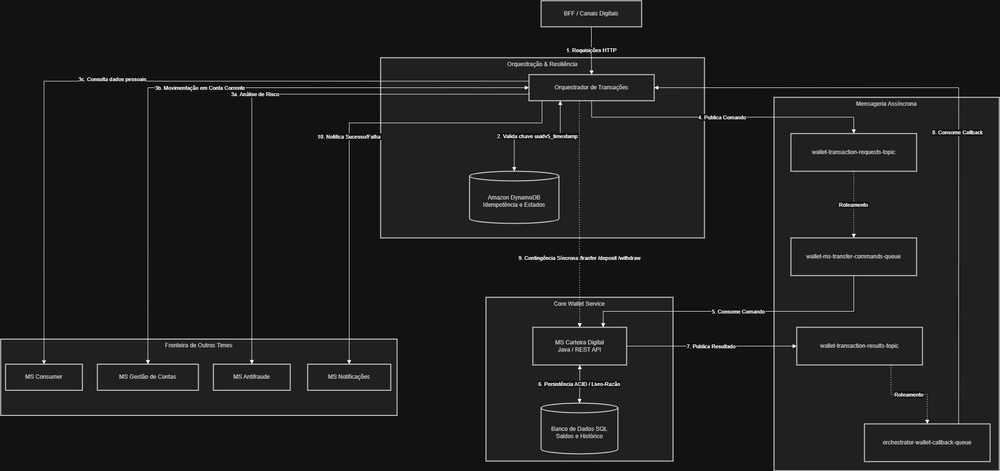
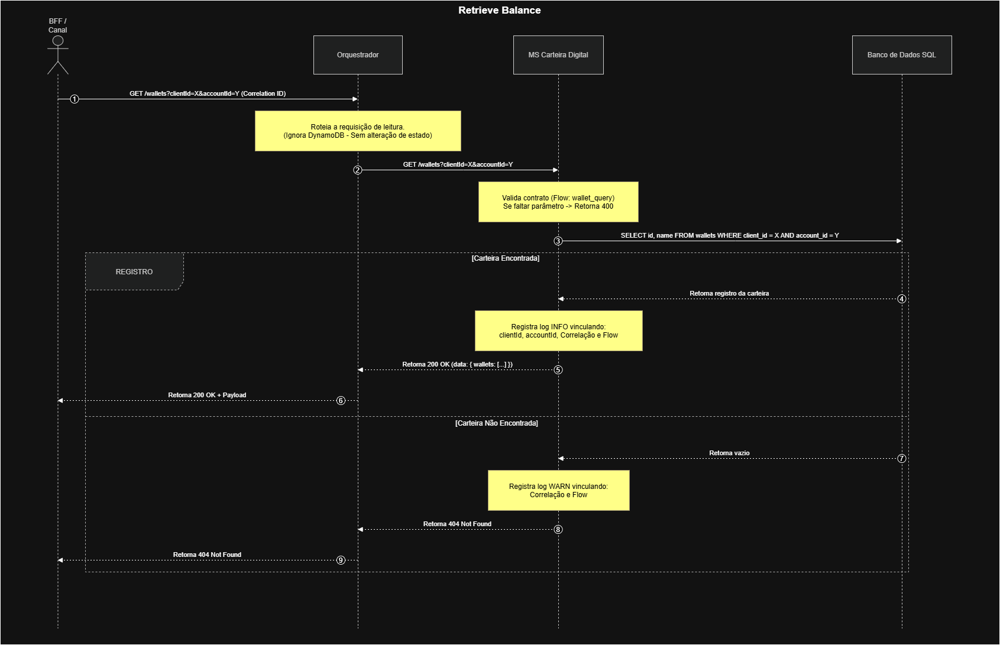
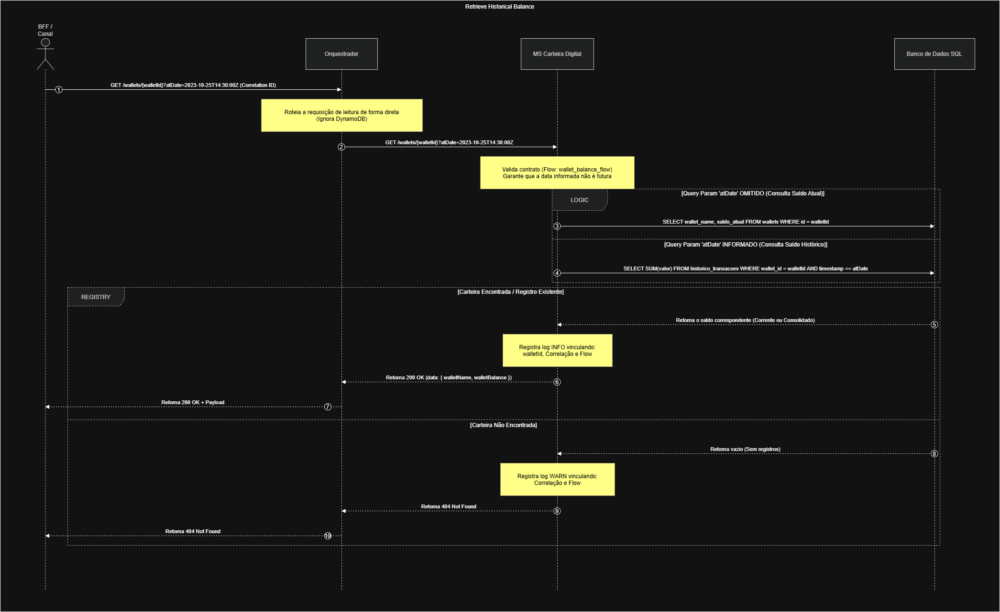
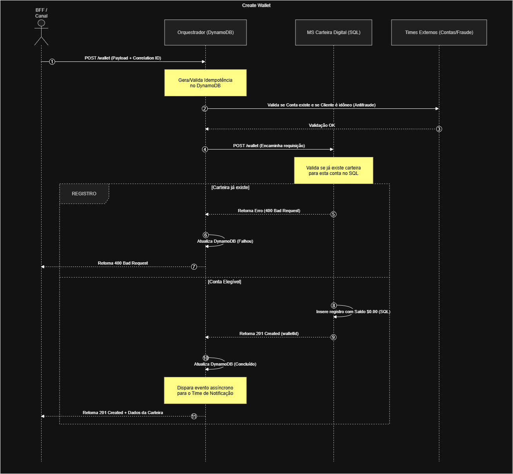
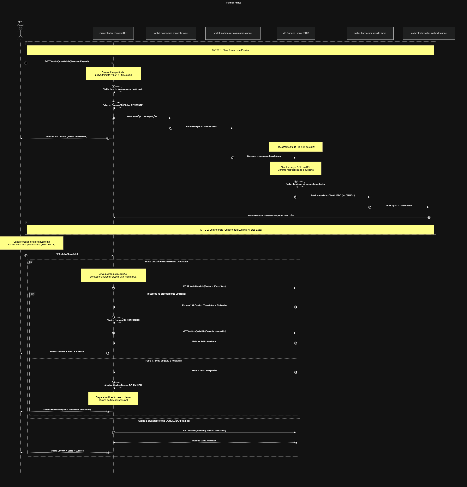
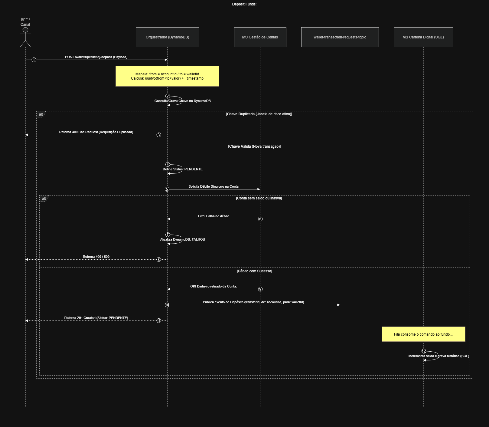
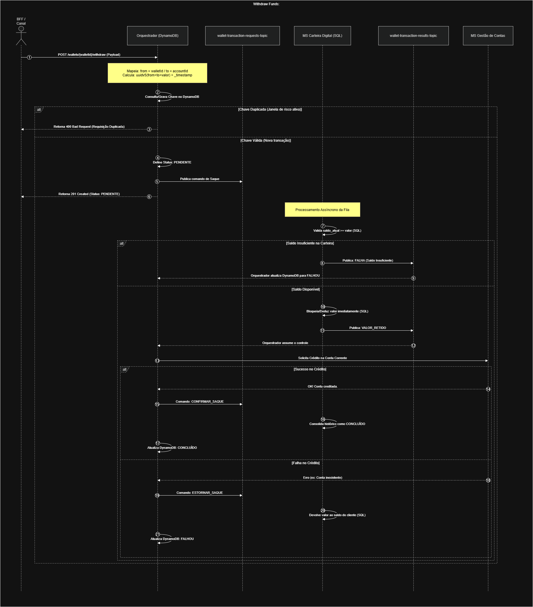

# Production-Ready Distributed Ledger & Digital Wallet Service (`ms-wallet-digital`)

This repository contains the core Digital Wallet Microservice (`ms-wallet-digital`), a mission-critical financial ledger engineered to handle secure value movements. The microservice operates as a high-throughput, append-only transaction ledger that guarantees absolute financial consistency, strict data integrity, and deterministic zero-double-spending capabilities under extreme concurrent loads.


---

## 1. Executive Summary & Quality Framework Alignment

This system is built from the ground up to fulfill the demands of an elastic, transactional fintech ecosystem. It treats monetary operations as state transitions within an isolated, atomic boundary. 

The architecture aligns systematically with global industry standards:
* **ISO/IEC 25010 Quality Model:** Maximizes *Functional Correctness* (zero-overdraft enforcement), *Reliability* (fault tolerance and database maturity via append-only ledger entries), *Security* (non-repudiation and transaction metadata containment), and *Performance Efficiency* (asynchronous horizontal scaling).
* **AWS Well-Architected Framework:** Follows *Operational Excellence* through structured, machine-readable telemetry; *Security* via principle of least privilege and defense-in-depth data processing; and *Reliability* through automated transient error recovery and loose-coupling boundaries.
* **iSAQB Core Principles:** Implements a strict *Separation of Concerns (SoC)*, explicitly drawing system perimeters and keeping domain models decoupled from infrastructure channels.

---

## 2. System Architecture & Core Design Patterns

The microservice balances low-latency responsiveness with absolute financial consistency by utilizing a **Dual-State Resilience Topology**. 

### Core Engineering Mechanisms
1.  **Append-Only Ledger Design:** To facilitate flawless financial auditing, balances are never edited directly via un-tracked updates. Every deposit, withdrawal, and transfer emits an immutable ledger record (`Movement`). The current balance is a deterministic projection of all successful ledger entries.
2.  **Row-Level Pessimistic Locking:** To completely neutralize concurrent distributed race conditions (such as double-withdrawal attempts across competing horizontal threads), the engine uses a database-level `SELECT ... FOR UPDATE` isolation block. 
3.  **Temporary Locked Balance Segregation:** When a debit sequence is initiated, the required funds are immediately carved out into a temporary `LOCKED` state within the database layer. This ensures that even if downstream external queues experience latency, those funds cannot be double-spent. The lock resolves to `DEDUCTED` upon successful completion or reverts smoothly to `AVAILABLE` upon failure.

---

## 3. Architectural Design Records (ADRs)

### ADR 01: Centralized Transaction Orchestrator & Fail-Fast Pipeline
* **Context:** Concurrent globally distributed transactions can hit the system simultaneously, creating risks of balance corruption, out-of-order execution, or downstream resource starvation.
* **Decision:** All value altering state changes are governed by a centralized **Transaction Orchestrator** leveraging a fast, distributed lock check backed by Amazon DynamoDB for rapid screening.
* **Consequences:** Enforces a rigid, zero-exception, multi-tier execution funnel before touching core relational tables:
    1.  *Idempotency Screen:* Halts instantly if a transaction request with an identical unique identifier is actively running or completed.
    2.  *Profile Vault Match:* Blocks execution if the client's CPF/CNPJ or parent account is frozen, blacklisted, or marked as inactive.
    3.  *Synchronous Risk Assessment:* Drops processing if the behavioral scoring from the Antifraud Engine flags the event as anomalous.
    4.  *Connectivity Check:* Verifies that the structural account bridge with the Core Checking Account Management system is open and valid.

### ADR 02: Dual-State Topology Resilience
* **Context:** Message queues can experience sudden spikes in latency or backlogs during peak traffic windows. However, user interfaces demand predictable response windows when completing critical customer flows.
* **Decision:** Implement an asynchronous processing layout as the default high-scale ingestion channel, complemented by an active **Synchronous Force-Exec Bypass** loop.
* **Consequences:** If a client application polls for transaction status and the orchestrator reads the state as `PENDING`, the orchestration system triggers an explicit synchronous fallback `POST` request directly to the microservice SQL database core. This forces immediate transaction execution and unblocks the user interface safely without waiting for queue backlog drain.

### ADR 03: Idempotency Key Enforced Verification
* **Context:** Network dropouts, automatic client retries, and queue redeliveries can inject duplicate payloads into the processing boundary, introducing severe double-crediting risks.
* **Decision:** The microservice treats every incoming command as strictly idempotent. It enforces a database-level unique constraint lookup against an external unique identifier (`transferId`) on all ledger entry executions.
* **Consequences:** Re-submitting an already processed transaction results in an immediate, safe return of the original receipt metadata without modifying the database balance state or repeating business actions.

---

## 4. Core Assumptions & Business Boundaries

To deliver a pristine, zero-downtime execution block within a focused engineering scope, the following structural constraints and domain boundaries were established:

### Satellite Domain Isolations
* **Identity Federation Separation:** Human credential management, JWT validation, and token rotation are entirely delegated to the enterprise *Customer Auth/Login Provider*.
* **Behavioral Protection Separation:** Deep entity risk scoring is decoupled and delegated to the specialized *Fraud Detection Engine*.
* **PII Sanitization Constraint:** Personally Identifiable Information (PII) is completely isolated inside the *Privacy Vault*. The ledger interacts strictly with obfuscated UUID handles (`clientId`, `accountId`, `walletId`).
* **Notification Engine Decoupling:** Emitting alerts via SMS, Push, or Email is handled entirely via out-of-band asynchronous event consumption by the *Notification Microservice*.

### Strict Business Restrictions
1.  **Monetary Monolith Bounds:** The ledger operates and clears calculations **exclusively using the Brazilian Real (BRL)** currency.
2.  **Strict Identity Cardinality:** A single natural person (*Pessoa Física - PF*) maps to exactly one active account instance, which structurally maps to **exactly one digital wallet instance (Main Wallet)**.
3.  **Zero-Overdraft Enforcement Rule:** Overdrafts, credit bounds, and negative balances are forbidden at the engine level. No business event can drive the ledger value below absolute zero ($0.00$).

---

## 5. Functional Capabilities & Use Cases

### Unified Idempotency Formula
To guarantee deterministic execution tracking across all operational nodes, the unique tracking handle is established via a SHA-1 `UUID v5` hash generated from the immutable business variables combined with the origin request timestamp:

$$\text{IdempotencyKey} = \text{uuidv5}(\text{fromIdentity} + \text{toIdentity} + \text{amount}) + \text{"\_"} + \text{timestamp}$$

### Ledger Operations Matrix

| Use Case           | Domain Context | Source Handle (`from`) | Destination Handle (`to`) | Operational Mechanics |
|:-------------------| :--- | :--- | :--- | :--- |
| **UC05: Deposit**  | External Funding | `accountId` (Checking Account) | `walletId` (Digital Wallet) | Pulls funds from an external core checking infrastructure and loads them into the digital wallet bounds. Emits an `INCOMING` entry. |
| **UC06: Withdraw** | Value Defunding | `walletId` (Digital Wallet) | `accountId` (Checking Account) | Moves value out of the digital ecosystem back to a personal bank account. Performs pre-flight checks and records an `OUTGOING` entry. |
| **UC04: Transfer** | Peer-to-Peer Shift | `walletId` (Origin Wallet) | `walletId` (Target Wallet) | Executes atomic inner-ledger balance rebalancing across two distinct digital wallets managed within this microservice core. |

### Historical Time Travel Balance Reconstruction
To fulfill audit mandates without storing infinite snapshot rows, the service uses an active **reverse-arithmetic ledger backtracking algorithm**. When a client requests the wallet balance at a specific point in the past (`atDate`), the service:
1.  Fetches the live, real-time current balance from the database row.
2.  Queries the immutable ledger table for all `COMPLETED` movements that occurred **after** the target date up until the current moment.
3.  Reverses those operations mathematically: it **subtracts** subsequent `INCOMING` entries and **adds** subsequent `OUTGOING` entries back to the total.

---

## 6. API & Event Contracts (Interface Specifications)

The microservice exposes clean, predictable endpoints using standard HTTP status codes:
* `200 OK`: Successful retrieval of query states and calculations.
* `201 Created`: Successful creation of entities or finalization of write operations.
* `400 Bad Request`: Validation contract breakdown or attempt to violate the zero-overdraft rule.
* `404 Not Found`: Target entity identifier does not exist in the database.
* `500 Internal Server Error`: Infrastructure failure; triggers automatic alerts for the engineering team.

### REST Endpoint Definitions

#### GET `/wallets`
Retrieves active digital wallet mappings matching user filters.
* **Query Parameters:** `clientId` (Required, UUID), `accountId` (Required, UUID)
* **Response Payload (`200 OK`):**
```json
{
  "data": [
    {
      "id": "a1b2c3d4-e5f6-7a8b-9c0d-1e2f3a4b5c6d",
      "name": "Main Wallet",
      "balance": 1500.50,
      "clientId": "77112233-e5f6-7a8b-9c0d-1e2f3a4b5c6d",
      "accountId": "88445566-e5f6-7a8b-9c0d-1e2f3a4b5c6d"
    }
  ]
}

```



#### GET `/wallets/{walletId}`

Retrieves live or historical time-travel statements.

* **Path Variable:** `walletId` (UUID)
* **Query Parameter:** `atDate` (Optional, ISO-8601 UTC Timestamp format: `YYYY-MM-DDTHH:mm:ssZ`)
* **Response Payload (`200 OK`):**

```json
{
  "data": {
    "walletId": "a1b2c3d4-e5f6-7a8b-9c0d-1e2f3a4b5c6d",
    "balance": 1500.50,
    "asOfDate": "2026-05-29T21:30:00Z"
  }
}

```



#### POST `/wallets`

Standard structural creation endpoint.

* **Request Body JSON:**

```json
{
  "clientId": "33445566-e5f6-7a8b-9c0d-1e2f3a4b5c6d",
  "accountId": "88772211-e5f6-7a8b-9c0d-1e2f3a4b5c6d"
}

```



#### POST `/wallets/{walletId}/transfer` (Force Exec Fallback)

Direct synchronous input injection.

* **Request Body JSON:**

```json
{
  "transferId": "tx_77665544",
  "amount": 250.00,
  "counterparty": {
    "id": "external_source_id"
  }
}

```



#### POST `/wallets/{walletId}/deposit` (Force Exec Fallback)

Direct synchronous input injection.

* **Request Body JSON:**

```json
{
  "transferId": "tx_77665544",
  "amount": 250.00,
  "counterparty": {
    "id": "external_source_id"
  }
}

```



#### POST `/wallets/{walletId}/withdraw` (Force Exec Fallback)

Direct synchronous withdrawal processing.

* **Request Body JSON:** Same as deposit schema.

### Asynchronous Message Contracts (RabbitMQ Target Queue)

Messages entering the ingestion pipeline through `wallet-ms-transfer-commands-queue` must align with the following JSON model:

```json
{
  "transferId": "tx_77665544",
  "id": "a1b2c3d4-e5f6-7a8b-9c0d-1e2f3a4b5c6d",
  "type": "TRANSFER",
  "amount": 250.00,
  "counterparty": {
    "id": "wlt_91a0b3c2-d4e5-6f7g-8h9i-0j1k2l3m4n5o"
  }
}

```



---

## 7. Observability, Telemetry & QA Guardrails

### ECS-Compliant Mapped Diagnostic Context (MDC) Logging

To ensure end-to-end tracing across async message hops, logs are emitted as single-line JSON items structured under the **Elastic Common Schema (ECS)** specifications, embedding required business context variables inside the MDC labels node:

```json
{
  "@timestamp": "2026-05-29T15:21:00.123Z",
  "log.level": "INFO",
  "message": "Ledger transaction processed successfully by core engine",
  "service.name": "ms-wallet-digital",
  "process.thread.name": "RabbitMqConsumerContainer-1",
  "log.logger": "com.poc.ms_wallet_digital.services.WalletService",
  "labels": {
    "correlation_id": "tx_77665544",
    "flow": "async_transfer",
    "wallet_id": "a1b2c3d4-e5f6-7a8b-9c0d-1e2f3a4b5c6d"
  }
}

```

### Real-Time Micrometer Metrics Tracking

Successful ledger commits trigger real-time metric updates through Micrometer bindings, registering on Prometheus with status tags matching the transactional outcome (`SUCCESS` or `FAILED`), and operation context (`DEPOSIT`, `WITHDRAW`, `TRANSFER`).

### Pipeline Testing Guardrails

Our integration pipeline establishes three absolute gates that code changes must clear before automated Canary staging on Amazon EKS can occur:

1. **SonarQube Validation Gate:** Instantly blocks pull requests containing code smells, security vulnerabilities, or exposed operational secrets.
2. **The 80% Coverage Requirement Rule:** Enforces a rigid **80% line test coverage minimum** via JaCoCo across all domain services.
3. **The 80% Mutation Score Rule:** Enforces an active **80% mutation kill score via PITest**. This forces tests to validate behavioral assertions (by destroying artificially injected byte-code mutants) rather than just executing lines.

---

## 8. Engineering Compromises, Trade-offs & Time Investment

To fulfill the requirements within a practical development window while ensuring a production-grade codebase, the following professional engineering trade-offs were consciously implemented:

### Implemented Trade-offs & Rationale

* **H2 Testing Slice Database substitution:** Instead of wiring a dynamic Testcontainers Docker sequence for PostgreSQL during repository layer unit verification, we substituted an in-memory `H2 Database` profile. This significantly speeds up pipeline verification times while testing derived method queries safely.
* **Optimistic Read / Pessimistic Write balance:** We utilized a row-level `LockModeType.PESSIMISTIC_WRITE` on critical mutations while keeping balance lookups completely lock-free via clean read-only transaction scopes. This maximizes query performance while protecting write mutations against concurrent corruption.
* **Micrometer SimpleMeterRegistry abstraction:** Rather than embedding a heavy network-connected push gateway infrastructure for metrics during local testing, we introduced Micrometer’s `SimpleMeterRegistry` in the service test environment. This tests the metrics engine logic without introducing infrastructure bottlenecks.

### Total Time Investment

* **Architecture, Model Modeling & ADR Documentation:** ~2.0 Hours
* **JPA Relational Mapping & Data Layer Testing (`@DataJpaTest`):** ~2.0 Hours
* **Core Business Logic Engine Development (`WalletService`):** ~2.0 Hours
* **Asynchronous Message Handlers & Controller Web Suite Validation:** ~1.5 Hours
* **Total Project Execution Window:** **~7.5 Hours**

---

## 9. Local Infrastructure Quickstart Manual

The environment is containerized via Docker Compose to spin up a local replica of our cloud infrastructure topology.

### Quick Start Setup Script

```bash
# 1. Spin up the infrastructure components in the background
docker compose up -d

# 2. Compile, run static code verification, and execute all test suites
./gradlew clean test

# 3. Launch the Spring Boot application using the dedicated local profile
./gradlew bootRun --args='--spring.profiles.active=local'

```

### Infrastructure Endpoint Directory

Once the containers are online, the following administration panels and diagnostic endpoints are accessible locally:

| Infrastructure Tool | Local Web Portal URL | Authentication Defaults | Operational Role within Ecosystem |
| --- | --- | --- | --- |
| **Swagger UI Docs** | [http://localhost:8080/swagger-ui/index.html](https://www.google.com/search?q=http://localhost:8080/swagger-ui/index.html) | *Open Access* | Interactive REST API portal for payload verification and manual execution testing. |
| **RabbitMQ Console** | [http://localhost:15672](https://www.google.com/search?q=http://localhost:15672) | `admin` / `admin` | Real-time broker platform management panel to track queue volumes and message routing. |
| **Prometheus Telemetry** | [http://localhost:9090](https://www.google.com/search?q=http://localhost:9090) | *Open Access* | Scraping time-series datastore that aggregates Micrometer counters emitted from the service. |
| **Grafana Dashboards** | [http://localhost:3000/login](https://www.google.com/search?q=http://localhost:3000/login) | `admin` / `admin` | Visualization interface wired to generate analytical health displays of the clearing ledger engine. |
| **SonarQube Server** | [http://localhost:9000](https://www.google.com/search?q=http://localhost:9000) | `platform_admin` / `secure_password` | Local static code analysis cockpit assessing quality gates and lint health. |

---